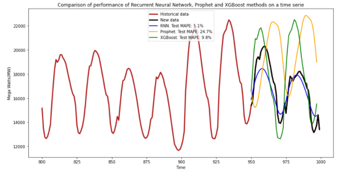

# Recurrent Neural Network vs Prophet vs XGBoost

 
 
The objective of this work is to do a comparison of performance of several non-traditional methods to model time series. In this case, I used this data, which is available on kaggle. The data set is about the hourly power consumption in Mega Watts of different areas of EEUU. I took 1000 samples, 950 to train and 50 to test the performance.
The measure used to do the comparison was the Mean Absolute Percentage Error(MAPE), it is a percentaje that shows the mean or average of the absolute percentage errors of forecasts.
